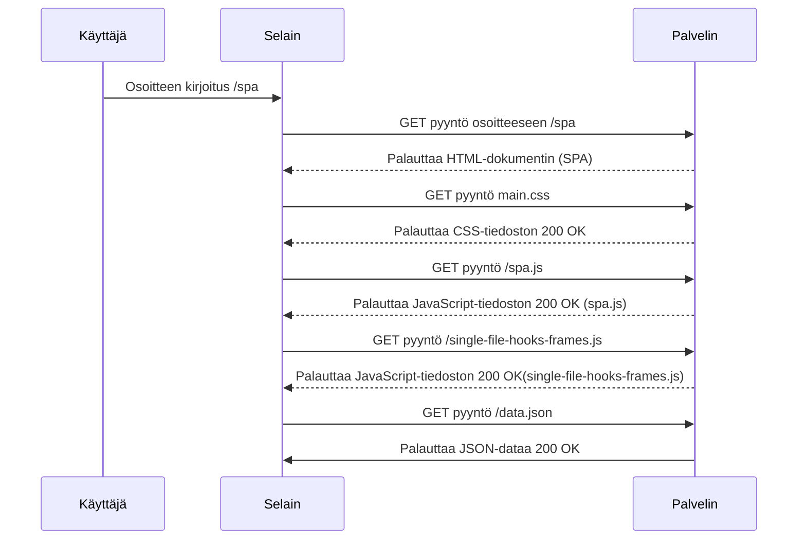

```mermaid
sequenceDiagram
    participant Käyttäjä
    participant Selain
    participant Palvelin

    Käyttäjä->>Selain: Osoitteen kirjoitus /spa
    Selain->>Palvelin: GET pyyntö osoitteeseen /spa
    Palvelin-->>Selain: Palauttaa HTML-dokumentin (SPA)
    Selain->>Palvelin: GET pyyntö main.css
    Palvelin-->>Selain: Palauttaa CSS-tiedoston 200 OK
    Selain->>Palvelin: GET pyyntö /spa.js
    Palvelin-->>Selain: Palauttaa JavaScript-tiedoston 200 OK (spa.js)
    Selain->>Palvelin: GET pyyntö /single-file-hooks-frames.js
    Palvelin-->>Selain: Palauttaa JavaScript-tiedoston 200 OK(single-file-hooks-frames.js)
    Selain->>Palvelin: GET pyyntö /data.json
    Palvelin->>Selain: Palauttaa JSON-dataa 200 OK
   
    
```
